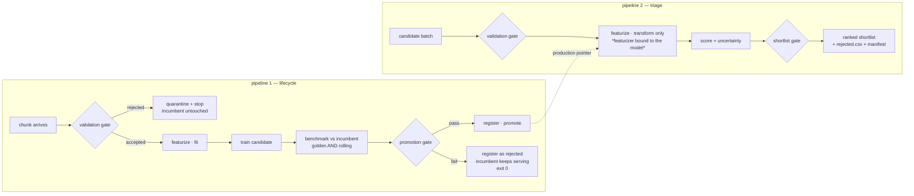

# ml-orch — QM9 model lifecycle and candidate triage

Two pipelines over one set of primitives. The claim worth checking is §2.

```bash
python -m venv .venv && .venv/bin/pip install -e ".[orchestration,dev]"
.venv/bin/python scripts/fetch_qm9.py --out data/raw   # network; once
.venv/bin/python scripts/prepare_data.py               # chunks, golden set, candidates
.venv/bin/pytest                                       # 93 passed, 1 skipped, ~2s

.venv/bin/python scripts/demo.py                       # the whole story, including a rejection
.venv/bin/python scripts/eda.py                        # reports/EDA.md + nine figures
```

Either pipeline, one command each:

```bash
ml-orch run lifecycle --config configs/lifecycle.yaml   # pipeline 1, on demand
ml-orch run triage    --config configs/triage.yaml      # pipeline 2
ml-orch backfill      --config configs/lifecycle.yaml   # replay every chunk; idempotent
ml-orch watch         --config configs/lifecycle.yaml   # pipeline 1, on data arrival
ml-orch registry list                                   # what is serving, and what was rejected
ml-orch registry rollback                               # one command
```

Under Dagster, with the asset graph and the arrival sensor:

```bash
DAGSTER_HOME=$PWD/.dagster_home dagster dev -m ml_orch.orchestration.definitions
```

## 1. What it does



Measured on the six prepared chunks, `scripts/demo.py`:

| chunk | rows | outcome | golden score | rolling score | why |
|---|---|---|---|---|---|
| chunk_00 | 708 | promoted | 0.5916 | 0.0920 | cold start, beats the mean predictor |
| chunk_01 | 708 | promoted | 0.3787 | 0.0889 | |
| chunk_02 | 708 | promoted | 0.3007 | 0.1065 | |
| chunk_03 | 708 | promoted | 0.2715 | 0.1158 | |
| chunk_04 | 708 | promoted | 0.2605 | 0.1192 | |
| **chunk_05** | 709 | **rejected** | 0.2524 | 0.1158 | **+3.1%, but p=0.072 — inside the noise** |

Lower is better; 1.0 is roughly the score of predicting the mean.

That last row is the point of the whole system, and it was not staged. The
candidate really is slightly better and the gate blocked it anyway, because a
3.1% gain that a paired bootstrap cannot separate from noise is how a
production model starts thrashing. Note also that the *rolling* set said
promote (+55.9%, p=0.000) while the *golden* set said no. The model is adapting
well to recent chemistry and has not improved globally — two different
questions, which is exactly why both sets gate.

## 2. Why pipeline 2 is configuration rather than a rewrite

The promotion decision, the shortlist filter, **and ingest validation** are the
same abstraction: a predicate over records that emits a verdict, a
human-readable reason, machine-readable evidence, and — where it applies — a
row mask. Promotion reduces the records to one verdict; triage keeps the mask;
validation keeps the mask and decides what to do with the rows outside it.

Three factories, same shape, same return type:

| | builds | used by |
|---|---|---|
| `data.validation_gate(cfg)` | schema, min-rows, parseable-SMILES, duplicates, target-NaN, drift | both pipelines |
| `gates.promotion_gate(**cfg)` | sanity, binding, cold-start, margin, significance, per-target, slices | pipeline 1 |
| `gates.shortlist_gate(cfg)` | binding, property window, uncertainty, top-k | pipeline 2 |

| Primitive | pipeline 1 uses it as | pipeline 2 uses it as |
|---|---|---|
| `Source` | training chunk | candidate batch |
| `Validator` (a `Gate`) | quarantine bad training rows | drop unscoreable candidates |
| `Featurizer` | fit + transform | transform only, **loaded from the promoted model** |
| `ModelRegistry` | write + promote | read `production` |
| `Predictor` | score the held-out sets | score the candidates |
| **`Gate`** | promote / don't, with reasons | filter, with reasons |
| `RunManifest` | model + metrics + lineage | shortlist + lineage |

`configs/triage.yaml` is the whole of pipeline 2's novelty. Zero new classes.
Two tests assert this mechanically rather than trusting the prose:

- `test_shortlist_reuses_the_promotion_primitives.py` — the shortlist is a
  `CompositeGate` of `Gate`s over a `GateContext` returning a `GateDecision`.
- `test_triage_adds_no_new_code_paths` — parses `run_triage`'s AST and fails if
  it stops calling the shared primitives, or starts calling `read_csv`,
  `MolFromSmiles`, `fit`, or `transform` directly.

**A third pipeline, for free.** Active learning: invert the uncertainty gate
(`invert: true`) so it selects what the model *doesn't* know, take the top plate
of 96, send to assay, append the results as a new chunk — which fires pipeline
1's arrival trigger. One config flip, no new primitives.
`test_active_learning_is_one_config_flip` pins it, and the commented block at
the bottom of `configs/triage.yaml` is the config.

## 3. The gate

A composite of independent checks, each returning `(verdict, reason, evidence)`.
**Every check runs — no short-circuiting** — because a rejection record is read
by a human who needs all the reasons, not the first one. Gates that raise fail
closed.

| Check | Blocks promotion when |
|---|---|
| `sanity` | non-finite metrics, empty error vectors |
| `featurizer_binding` | the run's featurizer ≠ the one bound to the model |
| `cold_start` | no incumbent and the candidate doesn't beat a mean predictor by ≥20% |
| `minimum_margin` | improvement < 1% — anti-thrash |
| `significance` | the improvement is within noise (paired bootstrap) |
| `no_target_regression` | any single target regresses > 5%, however good the average |
| `slices` | a subgroup (heavy-atom count, fluorine) regresses > 10% |

Every threshold above is a number in `configs/lifecycle.yaml`. Changing policy
never requires touching code.

Four decisions worth defending:

**Normalisation.** QM9's twelve targets are in Debye, Hartree, Bohr², Bohr³ and
cal/(mol·K). A mean of raw MAEs is dominated by whichever target has the largest
magnitude — here `r2`, whose MAE is ~91 while `homo`'s is ~0.010 — and is
therefore meaningless. Each target's MAE is divided by that target's standard
deviation on the evaluation set before aggregating: MAE in units of "how much
this property actually varies". The policy is one function,
`gates.normalized_score`, and replacing it is a config change.

**Paired bootstrap, not point estimates.** The two models are scored on the same
molecules, and per-molecule difficulty is enormous shared variance. Unpaired
comparison here is underpowered to the point of uselessness.

**Two evaluation sets.** A frozen, stratified *golden* set that is never trained
on answers "did anything regress globally". A *rolling recent* set answers "is
this model adapting to the drift". Both gate. See the chunk_05 row above for
what it looks like when they disagree.

**The binding gate is not configurable.** Which property window, which
uncertainty ceiling, how many candidates — all policy, all in YAML. Scoring
with a featurizer that isn't the one bound to the model is not policy, it's a
defect, so `shortlist_gate` prepends `FeaturizerBindingGate` unconditionally.

### On the covariate shift — a claim worth checking before repeating it

The standard line is that QM9 is ordered by molecule size, so sequential chunks
give you drift for free. Measured, that is very nearly false. QM9 is **83.4%
nine-heavy-atom molecules**, and every size below eight appears within the first
4,000 of 133,885 rows. Slice it sequentially and every chunk after the first is
saturated at nine atoms: KS between first and last chunk is 0.046 on `gap` and
0.057 on `mu`. Only `alpha` moves, because polarizability scales with size.

So the shift here is **constructed on purpose**. `split_into_chunks(mode=
"size_ramp")` stratifies the sample across sizes and orders it by size: chunk 0
has a mean of 5.8 heavy atoms, rising to 9.0 by chunk 3 where QM9's own ceiling
stops it. Arrival order is manipulated; no value is. The drift gate then reads
KS 0.002 → 0.57 → 0.80 → 0.93 → 0.94 → 0.96 across the six chunks, and the
model is measurably worse on the molecules that arrive later — normalized MAE
0.192 on the smallest slice against 0.323 on the 8–10 heavy-atom slice. That is
what makes the drift and slice gates load-bearing rather than decorative.
`mode="sequential"` reproduces the received-wisdom version for comparison.

**Drift is non-blocking by default**, which is a policy choice rather than
timidity: these chunks drift by construction, and blocking ingest on drift
rejects exactly the data the system exists to adapt to. It is recorded loudly
and left to the promotion gate to adjudicate on held-out performance, where
"did the model actually get worse" can be answered. `blocking: true` is one key
away for a domain where novel input really is stop-the-line.

## 4. Versioning and failure handling

Five things are pinned and tied together by a `RunManifest`: **data** (content
hash of the chunk, not its filename), **featurizer**, **model**, **code** (git
sha, marked dirty), **config**. Any prediction traces to exactly one manifest;
every shortlist row carries its `run_id` and `model_version`.

- **The featurizer is stateful on purpose.** RDKit descriptors are per-molecule,
  so a pure-function featurizer would have made "bound to the model" a label
  with nothing behind it — any copy would behave identically. Instead `fit`
  learns descriptor means/stds and which fingerprint bits were ever set, and
  both are hashed into `version`. A mismatched pair now produces genuinely
  different numbers, and `load_bound` refuses to return one. `demo.py` step 6
  demonstrates the refusal.
- **Idempotency is keyed on content.** The same chunk arriving twice does not
  retrain — including after its model has been archived, which is the version
  of this bug that survives a casual test.
- **A failed gate is a normal outcome.** The candidate is registered as
  `rejected` with its full decision record, artifacts are kept for forensics,
  the incumbent keeps serving, and the process exits 0 with a structured log.
  Nothing raises. A non-zero exit would tell a scheduler the pipeline broke.
- **Registry stages** `staging` / `production` / `archived` / `rejected`, with
  one-command rollback. Index writes are write-then-`os.replace`, so a crash
  mid-promotion cannot leave an ambiguous production pointer.
- **Three ingest policies**, because "what do we do with bad data" is a business
  question. `quarantine` (default) drops offending rows and keeps them with the
  gate that dropped them; `reject_chunk` is all-or-nothing, so a single masked
  row rejects the batch; `warn` accepts everything while recording what *would*
  have been dropped — how you learn what a policy will cost before enforcing it.
  A structural failure (missing column) rejects under all but `warn`: there are
  no offending rows to drop, the shape is wrong.
- **Partial failure in batch scoring.** Unscoreable candidates are dropped,
  listed in `rejected.csv` with the gate that dropped them, and do not kill the
  run.

## 5. Choices, and what they cost

**Dagster** over Prefect and Airflow. Software-defined assets make the model an
asset with real lineage, and `candidate_shortlist` declaring `promoted_model` as
a dependency puts the production pointer in the graph rather than in prose.
`Config` schemas make "pipeline 2 is new config" literally true. Sensors handle
arrival natively, and `run_key` on the content hash gives orchestrator-level
dedupe on top of the pipeline's own. Cost: more setup than Prefect, and one real
accommodation — `definitions.py` must not use `from __future__ import
annotations`, because Dagster resolves `Config` classes from live annotation
objects. The primitives were kept Dagster-free, which is what makes that cost
bounded: `ml_orch.orchestration` is the only package that imports it, and
`cli.py` runs everything without it.

**Own registry over MLflow.** ~200 readable lines against a service to stand up.
MLflow is more "real"; this is more legible to a reviewer and has no infra. In
production I would take MLflow and keep this interface in front of it.

**RandomForest over gradient boosting**, and this is an orchestration decision,
not an accuracy one. Triage gates on uncertainty, and a forest gives
per-prediction spread across trees for free; boosting would need three quantile
models per target to say anything about uncertainty at all. A gate with nothing
to gate on is a hole in the design. One estimator is fitted per target, so a
per-target error vector exists for the significance test and one target
degrading is attributable rather than diluted.

**sklearn over chemprop.** Chemprop has a real CLI, so it drops in as a 
subprocess step behind the same `Trainer` /
`Predictor` protocols with no change to the DAG, and it ships
`chemprop/uncertainty`, which is the natural backend if the shortlist needs
calibrated uncertainty rather than forest spread. Designed for, not implemented
— see `refs/REFERENCES.md`.

**No LLM in the promotion decision.** A nondeterministic gate is a liability.
The defensible places for one are writing the human-readable rationale from the
structured `GateDecision`, and triaging gray-zone results into a review queue —
`registry.auto_promote: false` is the hook. Knowing where not to put it is the
point.


## 7. Known limitations, stated rather than hidden

- **Five targets are atom counting, not chemistry**, and the test for this has
  to be the right one. A linear model on element counts alone (nC, nN, nO, nF,
  nH) reproduces `u0 / u298 / h298 / g298` at **R² = 1.00000** and `zpve` at
  **0.997**. All five are excluded from the default gate targets, which leaves
  seven. The naive version of this test — a single fit against heavy-atom count
  — puts `u0` at 0.41 and would have confirmed the opposite conclusion.
  `ml_orch.eda.element_count_dominance` computes it; `reports/EDA.md` has the
  full table.
- **The usual remedy is weaker than advertised.** Atomization energies
  (`u0_atom` and friends, already in the source CSV) still score ~0.99 on the
  same test. They are an improvement on 1.00000, not a solution, and swapping
  to them would not have made those targets informative.
- Forest spread is a usable applicability-domain signal, **not** a calibrated
  interval, and is not claimed to be one.
- The rolling evaluation set overlaps the training data by construction (it is
  the last *n* chunks). It is there to answer "is this adapting", and the
  golden set is the one that answers "did anything regress" — but a reviewer
  should know the rolling numbers are optimistic.
- `data/golden.csv` and `data/reference_stats.json` are committed on purpose. A
  frozen evaluation set that regenerates from code is not frozen: edit the
  sampling and it silently becomes a different set, taking every historical
  metric with it.

## 8. Repo map

```
src/ml_orch/
  types.py         frozen value types: Versions, TargetMetrics, EvalReport, GateResult/Decision
  gates.py         the Gate protocol, promotion + shortlist gates, composition
  data.py          sources, validation gates, failure policies, chunking
  featurize.py     stateful RDKit featurizer, version binding, slice columns
  models.py        sklearn backends, baseline, artifact save/load with binding checks
  evaluate.py      predictions -> EvalReport (the only thing gates ever see)
  pipelines.py     run_lifecycle / run_triage — plain Python, no orchestrator
  registry.py      file-backed registry: stages, atomic writes, rollback
  manifest.py      RunManifest, content/config/code hashing
  eda.py           the analysis behind the design decisions, as functions
  cli.py           run · backfill · watch · registry
  orchestration/
    definitions.py the only file that imports Dagster

scripts/  fetch_qm9.py · prepare_data.py · demo.py · eda.py
configs/  lifecycle.yaml · triage.yaml
tests/    93 passed, 1 skipped — gating, validation, binding, registry, both pipelines
reports/  EDA.md + figures/ — the analysis behind the design decisions
refs/     REFERENCES.md — QM9 task/unit contract, chemprop notes, sandbox egress
```
