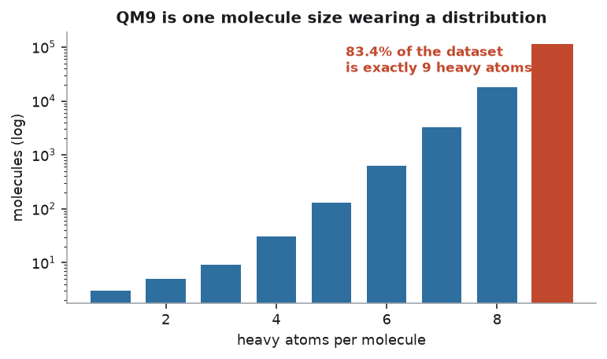
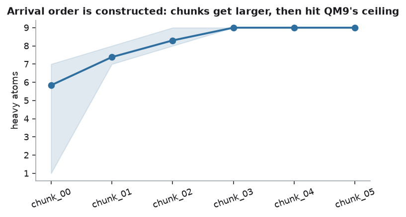
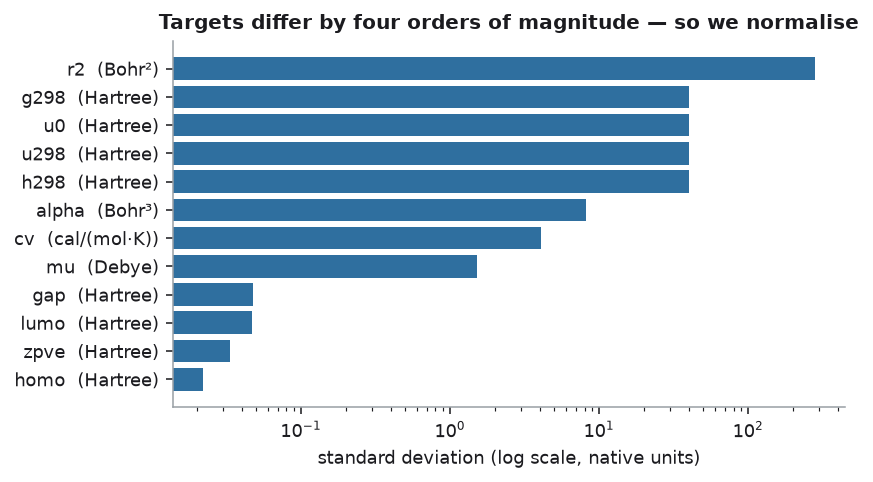
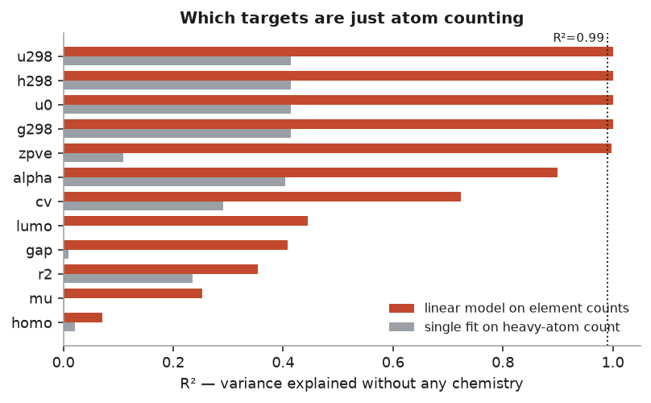
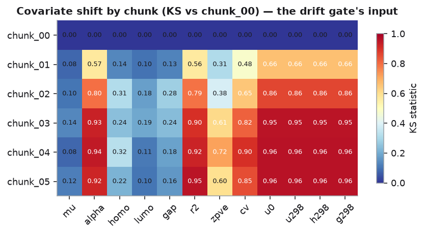
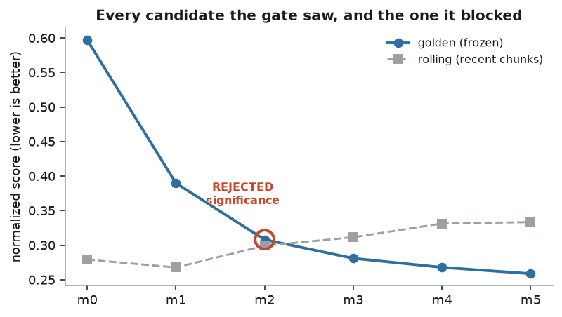
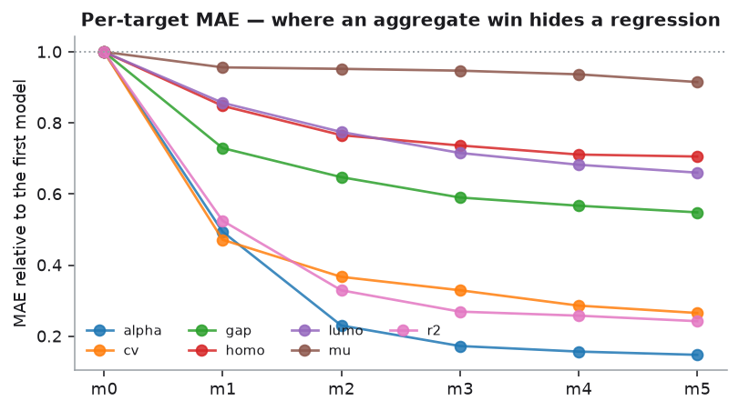
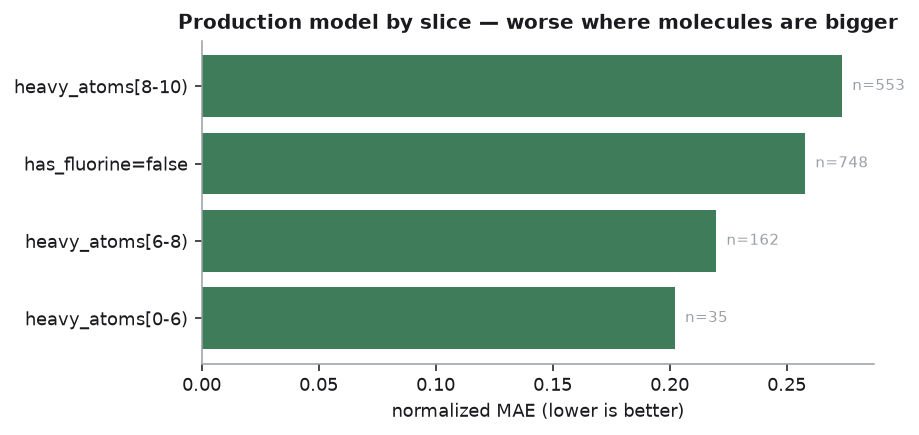
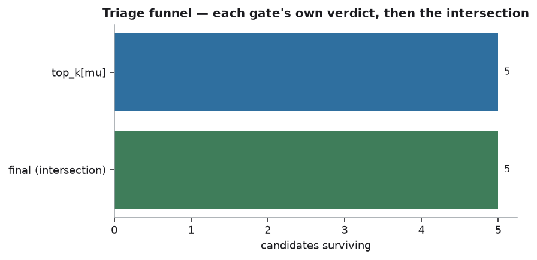

# EDA — what the data actually says

Generated by `scripts/eda.py`. Every figure here changed a design decision;
none of them are included because a chart was available.

## 1. QM9 is one molecule size wearing a distribution

- 133,885 molecules, of which **83.4% have exactly 9 heavy atoms**.
- The first 9-atom molecule appears at row 3,971 — so every size below it lives in the first 3% of the file.

**Consequence.** The folklore that sequential chunks of QM9 give you covariate
shift for free is very nearly false: slice it in order and every chunk after the
first is saturated. The shift in this project is therefore constructed on purpose
(`split_into_chunks(mode="size_ramp")`), which is stated rather than smuggled.

## 2. The targets are not comparable, so the aggregation policy is not optional

- Target standard deviations span **4.1 orders of magnitude**, in Debye, Hartree, Bohr², Bohr³ and cal/(mol·K).
- A mean of raw MAEs across them is dominated by whichever target has the largest
  units — here `r2`, whose MAE is ~91 against `zpve`'s ~0.008.

## 3. Some targets are atom counting, not chemistry

A linear model on element counts alone (nC, nN, nO, nF, nH) explains:

| target | R² from element counts | verdict |
|---|---|---|
| `u298` | 1.00000 | atom counting |
| `h298` | 1.00000 | atom counting |
| `u0` | 1.00000 | atom counting |
| `g298` | 1.00000 | atom counting |
| `zpve` | 0.99722 | atom counting |
| `alpha` | 0.89881 | real chemistry |
| `cv` | 0.72407 | real chemistry |
| `lumo` | 0.44413 | real chemistry |
| `gap` | 0.40779 | real chemistry |
| `r2` | 0.35411 | real chemistry |
| `mu` | 0.25211 | real chemistry |
| `homo` | 0.07161 | real chemistry |

**Two corrections to the received wisdom here.**

First, the test has to be the right one. A single-variable fit against heavy-atom
count puts `u0` at R²=0.41, which looks like an ordinary modelling problem. Against
element counts it is R²=1.00000. Testing the easy version would have confirmed the
wrong conclusion.

Second, `zpve` is at 0.99722 — essentially atom
counting too, and it was in the default gate targets. It has been removed, because
the rule that excludes the four energies has to apply to it as well.

And the usual remedy is weaker than advertised: the atomization energies
(`u0_atom` and friends) are still ~0.99 on the same test. They are an improvement
on 1.00000, not a solution.

The four energy targets correlate at 1.00000–1.00000 with each other — they are one quantity counted four times.

## 4. The drift is real, measurable, and deliberately non-blocking

- Maximum KS across all chunks and targets: **0.959**.
- By chunk (max across targets): `chunk_00`=0.00, `chunk_01`=0.66, `chunk_02`=0.86, `chunk_03`=0.95, `chunk_04`=0.96, `chunk_05`=0.96.

The drift gate records this loudly and does **not** block ingest. These chunks
drift by construction, and rejecting them would reject exactly the data the system
exists to adapt to. Whether the drift actually hurt is a question about held-out
performance, and that is the promotion gate's job.

## 5. What the gate did

| version                           | stage      |   golden_score |   rolling_score | verdict   | blocked_by          |
|:----------------------------------|:-----------|---------------:|----------------:|:----------|:--------------------|
| lifecycle-20260824T155147Z-6ecea3 | archived   |       0.597171 |        0.279199 | True      |                     |
| lifecycle-20260824T155149Z-db1071 | archived   |       0.389886 |        0.267848 | True      |                     |
| lifecycle-20260824T155152Z-1af518 | rejected   |       0.308114 |        0.299277 | False     | golden:significance |
| lifecycle-20260824T155155Z-fb5c44 | archived   |       0.281039 |        0.311577 | True      |                     |
| lifecycle-20260824T155159Z-8e517c | archived   |       0.26797  |        0.331439 | True      |                     |
| lifecycle-20260824T155204Z-e63543 | production |       0.258801 |        0.333495 | True      |                     |

The interesting row is the rejection. The candidate was genuinely better and
was blocked anyway, because the improvement could not be separated from noise
by a paired bootstrap — and a model promoted on noise thrashes.

